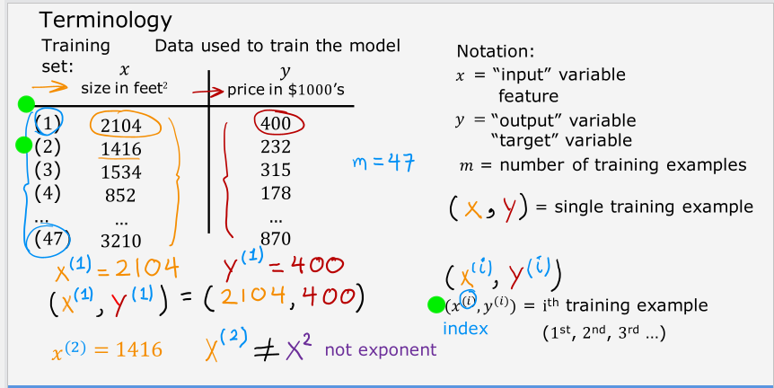
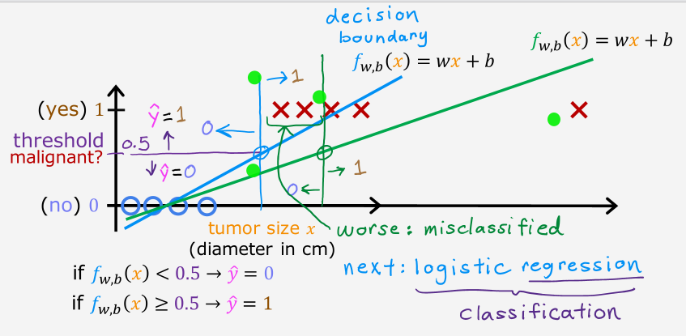
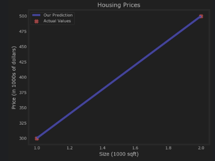

# Database: C1

## Mục lục (6 bài)
- [C1_Week1](#c1_week1)
- [C1_Week2](#c1_week2)
- [C1_Week3](#c1_week3)
- [Gradient Descent for Logistic Regression Code](#gradient descent for logistic regression code)
- [Multiple Regression Code](#multiple regression code)
- [Univariate Linear Regression Code](#univariate linear regression code)

---

## <a name="c1_week1"></a>C1_Week1


# Machine Learning - Học Máy


---


## Các thể loại Machine Learning:

- Supervised Learning
- Unsupervised Learning
- Recommender Systems
- Reinforcement Learning

---


### Supervised Learning


Học mà từ input X → Y để từ đó có thể dự đoán từ các input mới


Có 2 loại Supervised Learning:

- Regression:
    - Dự đoán một số, một model regression không có giới hạn trong các con số mà nó dự đoán
    - Ví dụ: dự đoán giá của một căn nhà khi có kích thước.
- Classification:
    - Phân loại, hoặc đơn giản hơn là dự đoán vào các nhóm output hữu hạn
    - Ví dụ: dự đoán(phân loại) xem khối u lành tính hay ác tính trong bệnh nhân ung thư vú.

---


### Unsupervised Learning


Giống supervised nhưng không có Y, máy phải tự tìm các pattern từ các thông tin input cho trước, giống như phân chia nhóm (Clustering), phát hiện bất thường(Anomaly). Hiểu đơn giản là tìm một cái gì đó “thú vị” từ data ấy.


Ví dụ: 

- Phân nhóm ở trong Google News từ các đề mục
- Phân loại khách hàng
- Phân nhóm trong DNA microarray




---


### Linear Regression

- Linear là “tuyến tính”, ở đây là việc mình vẽ một phương trình đường thẳng (hoặc là việc có thể được biểu diễn thành đường thẳng?)
- Regression là “hồi quy”, việc dự đoán một giá trị (không rõ lắm?)
- Một số ký hiệu quan trọng:


→ Về bản chất của một mô hình Linear Regression, mình sẽ cần một training set để huấn luyện cho một learning algorithm. Thuật toán ấy (phương trình tuyến tính) từ đó có thể được sử dụng, chuyển một input (feature) thành một prediction


# $x$$→$ $f_{w,b}$$→$$ŷ$


feature   →    model   →   prediction


### Trong đấy:

- x là training set
- f_w,b phương trình tuyến tính f(x) = wx + b
- ŷ là prediction từ model của mình

### Phân tích rõ hơn về model của mình:


## $f_{w,b} = wx + b$

- w (weight) là trọng số, na ná với hệ số góc trong phương trình y = ax + b
- b (bias) là độ lệch, b điều khiển độ cao thấp khi vẽ đồ thị
- Cả w và b được gọi là tham số (parameters)

→ Việc mình train một model chính là việc mình tìm ra bộ parameters phù hợp sao cho hợp với dữ liệu cho trước nhất có thể.


### Đến đây mình cần đánh giá xem liệu model của mình có hiệu quả không, nên mình sẽ tạo ra một Cost Function 


---


### Cost Function


### Nhắc lại Model của mình:


$f_{w,b}(x^{(i)}) = wx^{(i)} + b$


### Mình có thể việt lại thành prediction y hat:


$\hat{y}^{(i)} = f_{w,b}(x^{(i)})$


## Cost Function (Squared error cost function)


$J(w,b) = \frac{1}{2m} \sum_{i=1}^{m} \left( \hat{y}^{(i)} - y^{(i)} \right)^2$

- Khi viết đầy đủ ra:

$J(w,b) = \frac{1}{2m} \sum_{i=1}^{m} \left( f_{w,b}(x^{(i)}) - y^{(i)} \right)^2$

- Hàm cost function sẽ tính tổng tất cả các cost của từng training example trong training set, bình phương lên và chia cho 2 lần tổng số training examples (2m)
    - Lý do mình chia 2 là do sau này khi mình đạo hàm để sử dụng gradient descent, số 2 sẽ được triệt tiêu
    - Việc bình phương cũng giúp cho loại bỏ các cost nhỏ hơn không, mặt khác khiến các cost càng lớn sẽ lớn hơn nữa (vì bình phương)
    - Khi mình trừ đi:

        
    

$$
        f_{w,b}(x^{(i)}) - y^{(i)}
        $$
        đồng nghĩ với việc mình đang tìm khoảng các từ target tới dự đoán của mình vậy
        
→ Như đã viết bên trên, mình cần tìm cặp w, b sao cho prediction y hat gần với target nhất có thể.
$$


\text{Find } w, b: \hat{y}^{(i)} \text{ is close to } y^{(i)} \text{ for all } (x^{(i)}, y^{(i)})


$$
---
### Visualizing the Cost Function
### Nhắc lại Cost Function:
$$


J(w,b) = \frac{1}{2m} \sum_{i=1}^{m} \left( f_{w,b}(x^{(i)}) - y^{(i)} \right)^2


$$
- Giả sử giá trị của w và b nằm trong [-20, 20], trục đứng của đồ thị làm J(w,b), ta có hình vẽ:

- Graph của mình có dạng convex lồi, và nhận thấy nó có một cực tiểu duy nhất (Global Minimum), nên mình không sợ rằng quá trình học máy vấp phải những Local Minimum.
- Để sau này mình có thể hình dung rõ hơn đồ thị này, mình sẽ dùng các Contours (đường đồng mức) để giúp hiển thị rõ hơn giá trị, với mỗi hình elip có “cùng độ cao”(chung giá trị)(hoặc là cost bằng nhau)


- Note:
    - Nếu mình biết trước một cặp (w,b) thì mình sẽ chỉ biết MỘT ĐIỂM trên đồ thị.
    - Nếu mình biết được một giá trị (ví dụ b = 0) , thì parameter còn lại với J(w,b) sẽ được vẽ thành một hình parabol
    
---
### Gradient Descent
- Gradent Descent chính là thuật toán giúp tối ưu hoá w, b, chạy lặp đi lặp lại sao cho Cost Function đạt giá trị nhỏ nhất.
- Gradient Descent có thể được sử dụng cho bất cứ Model nào, không chỉ giới hạn ở Linear Regression.
- Các bước thực hiện Gradient Descent:
    - Bắt đầu ở một giá trị w, b (có thể ở w = 0, b = 0)
    - Thay đổi w và b qua từng vọng lặp liên tục để giảm Cost Function J(w,b)
    - Thay đổi cho tới khi J(w,b) đạt được cực tiểu.
→ Để thay đổi được w và b , ta có các công thức:
$$


\begin{align*}tmp\_w &= w - \alpha \frac{\partial}{\partial w}J(w,b) \\tmp\_b &= b - \alpha \frac{\partial}{\partial b}J(w,b) \\w &= tmp\_w \\b &= tmp\_b\end{align*}


$$
- Trong đó:
    - Alpha(**α)** là learning rate (hoặc step size). α sẽ quyết định việc qua mỗi lần lặp Gradient Descent sẽ đi xuống (hoặc đi lên) bao xa. Nếu α nhỏ thì Gradient Descent sẽ chậm, nếu α quá lớn thì Gradient Descent sẽ có thể nhảy qua(Overshoot) cực tiểu, dẫn đến việc không thể converge
    - tmp_w và tmp_b là các biến tạm của w và b được tính bởi THAM SỐ CŨ
    - Nhớ rằng đạo hàm bản chất là để tính độ dốc. Phần đạo hàm đằng sau là để tính liệu xem phải chỉnh w và b như thế nào, bởi vì đạo hàm được nhân với Learning Step.
- Mình có thể viết cụ thể sau khi đã đạo hàm:
$$


w = w - \alpha \frac{1}{m} \sum_{i=1}^{m} (f_{w,b}(x^{(i)}) - y^{(i)})x^{(i)}


$$

$$


b = b - \alpha \frac{1}{m} \sum_{i=1}^{m} (f_{w,b}(x^{(i)}) - y^{(i)})
$$


### Note:

- Để ứng dụng được đúng Gradient Descent trong code, mình phải CẬP NHẬT ĐỒNG THỜI (Simultaneous Update), nghĩa là mình phải tính biến tạm bằng THAM SỐ CŨ, xong cập nhật cả 2 w và b cùng lúc.
- Mặc dù khi chạy Gradient Descent, learning rate không đổi, nhưng đạo hàm thay đổi. Khi càng tới gần cực tiểu đồ thị, đạo hàm sẽ càng trở nên nhỏ hơn, nên dẫn tới các bước nhảy của cũng nhỏ hơn.


---


Khi mình chạy Gradient Descent các bước nhảy sẽ được minh hoạ như:


- Có thể thấy giữa các bước nhảy, các cost được giảm xuống dần dần và đến gần với cực tiểu, cũng như là phương trình đường thẳng của mình được chỉnh hoá sao cho phù hợp nhất với Training Set


---

## <a name="c1_week2"></a>C1_Week2


### Linear Regression With Multiple Variables


Trong tuần một mình đã học về Linear Regression với một ẩn, một cặp tham số (w,b). Những trong thực tế một Model Machine Learning sẽ đòi hỏi nhiều chi tiết hơn từ đầu vào, chẳng hạn như khi mua nhà, mình cần cân nhắc kích thước, số tầng, số phòng ngủ, … của chiếc nhà nên tuần này sẽ học về Linear Regression with Multiple Variables. 


Nhắc lại Model Linear Regression 1 ẩn tuần trước:


$$
f_{w,b}(x)=wx+b
$$


Model Linear Regression nhiều ẩn sẽ như sau:


$$
f_{w,b}(\mathbf{x}) = w_1x_1 + w_2x_2 + \cdots + w_nx_n + b
$$


Mình có thể viết dưới dạng tổng sigma:


$$
f_{w,b}(\mathbf{x}) = \sum_{i=1}^{n} w_i x_i + b
$$


Sau này sẽ sử dụng sự biểu diễn dưới dạng vector ngắn gọn nhiều hơn:


$$
f_{\vec{w},b}(\vec{x})=\vec{w}\cdot\vec{x}+b
$$


---


### Vectorization


Vector hoá nói về việc sử dụng Vector để tăng tốc độ học máy, tối ưu hoá việc viết code cũng như là trong quá trình tính toán.

- Code theo vòng lặp: (chạy theo từng vòng lặp chậm, không phù hợp khi có nhiều training data)

    ```python
    f = 0
    for j in range(0, 3):
        f = f + w[j] * x[j]
    f = f + b
    ```

- Code sử dụng vector hoá: (ngắn và dễ hiểu hơn)

    ```python
    import numpy as np
    w = np.array([1.0, 2.5, -3.3])
    b = 4
    x = np.array([10, 20, 30])
    f = np.dot(w, x) + b
    ```


→ Một lý do quan trọng trên hết mà buộc mình phải sử dụng vector hoá là việc sử dụng np.dot(w,x) giúp tận dụng tốt hơn phần cứng của máy tính, tạo ra một khác biệt lớn khi có một training set lớn trên thực tế.


---


### Gradient Descent for Multiple Regression


Đây là phần ứng dụng GD cho Multiple Regression.

- Nhắc lại Model của mình:


$$
f_{\vec{w},b}(\vec{x}) = \vec{w} \cdot \vec{x} + b
$$


- Gradient Descent theo vector: (giống với 1 ẩn, giờ thêm vector)


$$
w_j = w_j - \alpha \frac{\partial}{\partial w_j} J(\vec{w}, b)
$$


$$
b = b - \alpha \frac{\partial}{\partial b} J(\vec{w}, b)
$$


- Mình sẽ cập nhật với công thức:


$$
w_j = w_j - \alpha \frac{1}{m} \sum_{i=1}^{m} (f_{\vec{w},b}(\vec{x}^{(i)}) - y^{(i)}) x_j^{(i)}
$$


$$
w_j = w_j - \alpha \frac{1}{m} \sum_{i=1}^{m} (f_{\vec{w},b}(\vec{x}^{(i)}) - y^{(i)}) x_j^{(i)}
$$


→ Giống như Gradient Descent với 1 feature, mình vẫn phải CẬP NHẬT ĐỒNG THỜI (Simultaneous Update).


### Note:

- Ngoài Gradient Descent, mình cũng có một số cách khác để train một mô hình prediction, một trong số đó là Normal Equation.
- Một số lưu ý với Normal Equation:
    - Normal Equation chỉ có thể được sử dụng cho mô hình Linear Regression
    - Normal Equation có thể tìm ra được w và b tối ưu mà không cần sử dụng vòng lặp.
    - Normal Equation sẽ chạy chậm khi có nhiều feature (nhiếu biến input) khác nhau (>10000).

---


### Feature Scaling


Feature Scaling nói về việc mình phóng to hoặc thu nhỏ một feature về một khoảng nhất định (thường là nhỏ) để Model của mình dễ sử dụng hơn.

- Ví dụ như khi mình có một feature “kích thước căn nhà” với khoảng giá trị từ 300 - 2000, feature “số phòng ngủ” với khoảng giá trị từ 0 - 5, hậu quả là khi phác hoạ Cost Function sẽ bị kéo dài ra (kiểu cái bát biến dạng), khi chạy Gradient Descent sẽ chậm hơn.


→ Để khắc phục, mình sẽ cần chuẩn hoá (Standardization) các feature của mình sao cho khi vẽ lại sẽ được như này:


1. Chia cho giá trị lớn nhất:
- Chia cho giá trị lớn nhất giúp các feature khi đã rescale luôn bé hơn 1.


1. Mean Normalization
- Lấy hiệu của input với giá trị trung bình chia cho hiệu max và min, đưa các giá trị thường về khoảng [-1, 1] (chắc thế)


1. Z-score Normalization (dùng nhiều)

[https://www.geeksforgeeks.org/data-analysis/z-score-normalization-definition-and-examples/](https://www.geeksforgeeks.org/data-analysis/z-score-normalization-definition-and-examples/)


→ Mục tiêu của Feature Scaling là mình đưa các giá trị input vào các khoảng nhỏ chấp nhận được, chẳng hạn [-1,1], [-3,3], [-0.3, 0.3], [0, 3], [-2, 0.5],…


---


### Checking Gradient Descent for Convergence


Phần này là để kiểm tra xem liệu Gradient Descent của mình đang hoạt động đúng hay không. Do Gradient Descent được dùng để giảm Cost Function nên để kiểm tra, mình nên kiểm tra xem Cost có giảm qua các lần lặp hay không.


Khi mình đã biết là Cost đang giảm, mình cần phải biết khi nào Gradient Descent đã converge. Mình sẽ so sánh sự giảm của Cost qua mỗi lần lặp, nếu nhỏ hơn một giá trị **ε =** 10^-3 thì khẳng định là đã converge. Cos


---


### Feature Engineering


Phần này không dài, Feature Engineering nói về việc mình sử dụng trực giác để tạo ra các features mới, giúp ích trong việc học máy. Một số các cách mình có thể làm như vậy bằng cách biến đổi, hoặc cộng gộp các feature đã có sẵn.


Trong slide có một ví dụ:


→ Nhận thấy mình có thể tạo ra một feature mới là “diện tích nhà” bằng việc nhân 2 feature “mặt tiền” và “độ sâu” với nhau.


---


### Polynomial Regression


Ngoài Linear Regression bậc nhất, mình cũng có một số Model khác là Polynomial Regression, trong đó có các dạng đa thức bậc cao hơn. Khi mình vẽ hình ra thì mô hình đa bậc có thể tạo ra các đường cong mà có thể phù hợp với Training Set hơn một đường thẳng.


---

## <a name="c1_week3"></a>C1_Week3


# Classification


Classification là một thể loại khác của Supervised Learning, mục đích của Classification là dự đoán một thể loại (Catergory) từ một input mới. Nếu với Linear Regression mình có thể có vô vàn prediciton, thì ở Classification chỉ có một số output hữu hạn duy nhất.


### Motivations


Các trường hợp cần dùng Classification:

- Mình cần phân loại xem liệu một khối u là lành tính hay ác tính
- Phân loại xem email có phải là spam hay không
- Liệu lần chuyển khoản này có đáng nghi không?

(Note nhỏ: các Classification mà chỉ có thể có 2 output duy nhất được gọi là một “Binary Classification”)


---


### Linear Regression trong Classification


Trước khi đến với Logistic Regression, trong Classification mình cũng có thể dùng Linear Regression để phân loại output, chỉ là sẽ không ổn định, đặc biệt là khi có một Training Data nằm cá biệt. Dẫn tới đường thẳng của mình bị nghiêng quá mức, prediction dễ lệch.


---


### Logistic Regression


Để có thể đưa ra các predicition theo nhóm/ lớp một cách ổn định, Logistic Regression sẽ sử dụng Sigmoid Function - phương trình luôn output ra xác suất từ 0 đến 1. Xác suất ấy sẽ là tỷ lệ % liệu input có thuộc một nhóm/ lớp ấy không.




- Logistics Regression có đường con nhìn như này, với phương trình được định nghĩa:


$$
g(z)=\frac{1}{1+e^{-z}}
$$


- Model prediction của mình được viết dưới dạng:


$$
f_{\vec{w},b}(\vec{x})=g(z)
$$


→ Sau đó mình có thể viết lại bằng tích vô hướng của vector x và w, bởi sẽ có nhiều feature, tương ứng với nhiều trọng số


$$
f_{\vec{w},b}(\vec{x})=g(\vec{w}\cdot\vec{x}+b)
$$


→ Mặt khác, do hàm Sigmoid được viết ở dạng trên, mình có thể thay vào trong ngoặc:


$$
f_{\vec{w},b}(\vec{x})=\frac{1}{1+e^{-(\vec{w}\cdot\vec{x}+b)}}
$$


$$
e\approx 2.718
$$


Như trên, về bản chất Model đang có tìm ra rằng “khả năng với input này, liệu có phải thuộc nhóm/ lớp này hay không”, nên mình có thể biểu diễn theo ký hiệu này ngắn gọn:


$$
f_{\vec{w},b}(\vec{x})=P(y=1\mid \vec{x};\vec{w},b)
$$


Do mình viết y = 1, nên đây là tỷ lệ % là “1”(ví dụ là khối u ác tính, email spam…), nên nếu thay y = 0 thì tổng của 2 tỷ lệ là 100%


$$
P(y=0)+P(y=1)=1
$$


---


### Decision Boundary


Ở bên trên mình đã có cách để tìm tỷ lệ giữa 0 và 1 (0% - 100%) của một input nhất định qua Sigmoid Function, nhưng làm thế nào để mình có thể quyết định được nên phân nhóm input đấy như nào? Mình sẽ sử dụng một Decision Boundary.

- Mình nênn hớ rằng Decision Boundary là một đường biên cố gắng chia cắt các vùng dự đoán của các nhóm/ lớp khác nhau. Tuy vậy mình có thể định nghĩa dựa trên một ngưỡng số, chẳng hạn như 0.5, nếu hàm Sigmoid ra một prediction >0.5, thì output là 1, <0.5 thì ngược lại.
- Đây là một số hình dạng của Đường Biên lựa chọn:
    - Decision Boundary là một đường thẳng, có thể hiểu là một đường thẳng trên mặt phẳng (x1,x2)

    

    - Decision Boundary là một đường tròn.

    [https://loigiaihay.com/ly-thuyet-phuong-trinh-duong-tron-c45a5233.html](https://loigiaihay.com/ly-thuyet-phuong-trinh-duong-tron-c45a5233.html)


    

    - Decision Boundary không có một hình dạng nhất định do là hàm đa thức

    


### Note:

- Hình dạng của Decision Boundary phụ thuộc vào PHƯƠNG TRÌNH được đưa vào hàm Sigmoid, không phải là của CHÍNH hàm Sigmoid. Hàm Sigmoid luôn có đường cong như này:


---


### Cost Function For Logistic Regression


Nhớ lại phần Cost Function của Linear Regression, còn được gọi là Squared Error Cost Function:


$$
J(\vec{w},b)=\frac{1}{m}\sum_{i=1}^{m}\frac{1}{2}\left(f_{\vec{w},b}(\vec{x}^{(i)})-y^{(i)}\right)^2
$$


Tuy vậy, để mình có thể áp dục được Cost Function, nhớ rằng Gradient Descent của mình phải tìm được cực tiểu (Global Minimum) của cả đồ thị, không chỉ là một Local Minimum. Khi mình sử dụng hàm Squared Error Cost Function sẽ vấp phải điều này.


→ Mình cần tìm một Cost Function khác, gọi là Logistic Loss Function, được viết bằng:


$$
L\!\left(f_{\vec{w},b}(\vec{x}^{(i)}),\,y^{(i)}\right)=\begin{cases}-\log\!\left(f_{\vec{w},b}(\vec{x}^{(i)})\right) & \text{if }y^{(i)}=1\\-\log\!\left(1-f_{\vec{w},b}(\vec{x}^{(i)})\right) & \text{if }y^{(i)}=0\end{cases}
$$


- Hàm được viết dưới 2 trường hợp do có 2 target khả năng của một Model, là y = 0, y = 1. Do vậy.
- Do đầu vào của Logistic Cost Function là hàm Sigmoid, chỉ có thể đưa ra tỷ lệ giữa 0 và 1, nên khi biểu diễn trên đồ thị, 2 hàm Log âm dương nhìn như sau: (chỉ quan tâm đoạn [0,1])


- Để giải thích lý do cho việc sử dụng hàm log, chẳng hạn khi target của mình là y = 1, việc Model của mình (hàm Sigmoid) predict ra một con số càng gần tới 0, Cost sẽ nhảy vọt lên rất rất cao, điều ngược lại cũng vậy. (tận dụng việc tiệm cận đứng của cả hàm Log là trục Oy)
- Một lý do khác là các hàm Log trong đoạn [0,1] có dạng convex, nên việc tìm Global Minimum qua Gradient Descent diễn ra dễ dàng.

---


### Simplified Cost Function for Logistic Regression


Nhắc lại Logistic Cost Function:


$$
L\!\left(f_{\vec{w},b}(\vec{x}^{(i)}),\,y^{(i)}\right)=\begin{cases}-\log\!\left(f_{\vec{w},b}(\vec{x}^{(i)})\right) & \text{if }y^{(i)}=1\\-\log\!\left(1-f_{\vec{w},b}(\vec{x}^{(i)})\right) & \text{if }y^{(i)}=0\end{cases}
$$


→ Mình có thể viết gọn lại thành phương trình trên một dòng, tận dụng 2 trường hợp y = 0 và 


y = 1 như sau:


$$
L\!\left(f_{\vec{w},b}(\vec{x}^{(i)}),\,y^{(i)}\right)=-y^{(i)}\log\!\left(f_{\vec{w},b}(\vec{x}^{(i)})\right)-\left(1-y^{(i)}\right)\log\!\left(1-f_{\vec{w},b}(\vec{x}^{(i)})\right)
$$


- Hàm Cost Function khá dài, nhưng mình có thể chia thành 2 trường hợp:
- Nếu y = 1: (phép tính bên phải sẽ tự huỷ do nhân với 0)


$$
L\!\left(f_{\vec{w},b}(\vec{x}^{(i)}),\,y^{(i)}\right)=-1\cdot\log\!\left(f_{\vec{w},b}(\vec{x}^{(i)})\right)-0\cdot\log\!\left(1-f_{\vec{w},b}(\vec{x}^{(i)})\right)
$$


- Nếu y = 0: (phép tính bên trái sẽ tự huỷ do nhân với 0)


$$
L\!\left(f_{\vec{w},b}(\vec{x}^{(i)}),\,y^{(i)}\right)=-0\cdot\log\!\left(f_{\vec{w},b}(\vec{x}^{(i)})\right)-1\cdot\log\!\left(1-f_{\vec{w},b}(\vec{x}^{(i)})\right)
$$


- Kết hợp lại tất cả các công thức sẽ là một Logistic Cost Function hoàn chỉnh, bao gồm từng training data: (bỏ dấu trừ ra ngoài)


$$
J(\vec{w},b)=-\frac{1}{m}\sum_{i=1}^{m}\Big[y^{(i)}\log\!\left(f_{\vec{w},b}(\vec{x}^{(i)})\right)+\left(1-y^{(i)}\right)\log\!\left(1-f_{\vec{w},b}(\vec{x}^{(i)})\right)\Big]
$$


---


### Gradient Descent Implementation


Ta có công thức Logistic Cost Function:


$$
J(\vec{w},b)=-\frac{1}{m}\sum_{i=1}^{m}\Big[y^{(i)}\log\!\left(f_{\vec{w},b}(\vec{x}^{(i)})\right)+\left(1-y^{(i)}\right)\log\!\left(1-f_{\vec{w},b}(\vec{x}^{(i)})\right)\Big]
$$


- Gradient Descent sẽ chạy vòng lặp để update Weights và Bias như sau: (giống Linear Regression)


$$
w_j=w_j-\alpha\frac{\partial}{\partial w_j}J(\vec{w},b)
$$


$$
b=b-\alpha\frac{\partial}{\partial b}J(\vec{w},b)
$$


- Đạo hàm theo Weight để update Weight, đạo hàm theo Bias để update Bias:


$$
\frac{\partial}{\partial w_j}J(\vec{w},b)=\frac{1}{m}\sum_{i=1}^{m}\Big(f_{\vec{w},b}(\vec{x}^{(i)})-y^{(i)}\Big)x_j^{(i)}
$$


$$
\frac{\partial}{\partial b}J(\vec{w},b)=\frac{1}{m}\sum_{i=1}^{m}\Big(f_{\vec{w},b}(\vec{x}^{(i)})-y^{(i)}\Big)
$$


→ Một điều thú vị là cả phần đạo hàm và Gradient Descent của Logistic Regression giống với Linear Regression. Cùng chung format và đều phải Cập Nhật Đồng Thời.


---


### The Problem of Overfitting


Overfitting có nghĩa là “Vừa quá mức”, việc một Model học quá kỹ dữ liệu đầu vào, cả những chi tiết không cần thiết, có một slide minh hoạ được cả 3 khái niệm Underfit, Fit, Overfit:


1. Underfit: không phù hợp, có nhiều sai sót với training data
2. Fit: phù hợp vừa đúng với training data
3. Overfit: “vừa quá mức” mà đưa ra dự đoán ở những chỗ không cần thiết, thường có các đa thức quá cao hoặc quá phức tạp

Đây là hình minh hoạ của cả 3 khái niệm, nhưng là của Classification:


---


### Addressing Overfitting


Đối với cách giải quyết Overfitting, mình có:

1. Tăng số lượng Training Data


1. Lựa chọn nên/ không nên bao gồm các feature nhất định (đơn giản hoá số feature)
- Việc chọn lọc này có thể dẫn tới mất mát các feature hữu dụng nên cẩn thận.


1. Regularization
- Regularization sẽ được nói thêm ở dưới, trong phần này nhắc đến việc mình có thể giảm trọng số ở một số feature nhất định, đặc biệt là ở feature mang đa thức bậc cao.


---


### Cost Function with Regularization


Khi nhắc qua về Regularization ở bên trên về việc giảm trọng số ở một số feature nhất định (các feature mang đa thức bậc cao), mình có thể viết thêm một phần vào Cost Function để cho khi chạy Gradient Descent, các trọng số ấy sẽ tự giảm xuống bởi việc Cost tăng cao.


→ Bổ sung thêm vào Cost Function như sau:


$$
J(\vec{w},b)=\frac{1}{2m}\sum_{i=1}^{m}\left(f_{\vec{w},b}(\vec{x}^{(i)})-y^{(i)}\right)^2+\frac{\lambda}{2m}\sum_{j=1}^{n}w_j^2+\frac{\lambda}{2m}b^2
$$


Trên thực tế việc mình điều chỉnh bias là không cần thiết nên có thể được rút ngắn lại thành:


$$
\min_{\vec{w},b}J(\vec{w},b)=\min_{\vec{w},b}\left[\frac{1}{2m}\sum_{i=1}^{m}\left(f_{\vec{w},b}(\vec{x}^{(i)})-y^{(i)}\right)^2+\frac{\lambda}{2m}\sum_{j=1}^{n}w_j^2\right]
$$


- Lambda trong công thức có thể được tự chọn là một giá trị nào đó, trong slide ghi là 10^10

---


### Regularized Linear Regression


Hàm Cost Function được viết lại ở bên trên, giờ với cả Regularization:


$$
\min_{\vec{w},b}J(\vec{w},b)=\min_{\vec{w},b}\left[\frac{1}{2m}\sum_{i=1}^{m}\left(f_{\vec{w},b}(\vec{x}^{(i)})-y^{(i)}\right)^2+\frac{\lambda}{2m}\sum_{j=1}^{n}w_j^2\right]
$$


Gradient Descent giống như trước sẽ lặp đi lặp lại các update sau:


$$
w_j=w_j-\alpha\frac{\partial}{\partial w_j}J(\vec{w},b)
$$


$$
b=b-\alpha\frac{\partial}{\partial b}J(\vec{w},b)
$$


→ Với đạo hàm theo các phần tương ứng: (giờ có thêm phần Weight ở đằng sau)


$$
\frac{\partial}{\partial w_j}J(\vec{w},b)=\frac{1}{m}\sum_{i=1}^{m}\left(f_{\vec{w},b}(\vec{x}^{(i)})-y^{(i)}\right)x_j^{(i)}+\frac{\lambda}{m}w_j
$$


$$
\frac{\partial}{\partial b}J(\vec{w},b)=\frac{1}{m}\sum_{i=1}^{m}\left(f_{\vec{w},b}(\vec{x}^{(i)})-y^{(i)}\right)
$$


- Việc thêm phần tính trọng số đằng sau của đạo hàm là để giúp khi nhân với stepping size, vế phải sẽ lớn hơn một chút, dẫ đến việc w khi cập nhật sẽ nhỏ hơn bình thường (mục đích của regularization)

---

<details>
<summary>Chứng minh công thức đạo hàm (xem tham khảo)</summary>

Ta có:


$$
\frac{\partial}{\partial w_j}J(\vec{w},b)
=
\frac{\partial}{\partial w_j}\left[
\frac{1}{2m}\sum_{i=1}^{m}\left(f_{\vec{w},b}(\vec{x}^{(i)})-y^{(i)}\right)^2
+\frac{\lambda}{2m}\sum_{j=1}^{n}w_j^2
\right]
$$


Với:


$$
f_{\vec{w},b}(\vec{x}^{(i)})=\vec{w}\cdot\vec{x}^{(i)}+b
$$


Ta viết lại:


$$
\frac{\partial}{\partial w_j}J(\vec{w},b)=\frac{1}{2m}\left[\sum_{i=1}^{m}2\left(\vec{w}\cdot\vec{x}^{(i)}+b-y^{(i)}\right)x_j^{(i)}+\frac{\lambda}{2m}\cdot 2w_j\cdot 2m\right]
$$


Rút gọn số 2:


$$
\frac{\partial}{\partial w_j}J(\vec{w},b)=\frac{1}{m}\sum_{i=1}^{m}\left(\vec{w}\cdot\vec{x}^{(i)}+b-y^{(i)}\right)x_j^{(i)}+\frac{\lambda}{m}w_j
$$


Rút ngắn lại thành ký hiệu phương trình:


$$
\frac{\partial}{\partial w_j}J(\vec{w},b)=\frac{1}{m}\sum_{i=1}^{m}\left(f_{\vec{w},b}(\vec{x}^{(i)})-y^{(i)}\right)x_j^{(i)}+\frac{\lambda}{m}w_j
$$


</details>


---


### Regularized Logistic Regression


Phần này giống bên trên chỉ là khác Model.


Khi mình Regularize Logistic Regression mình chỉ thêm phần của trọng số vào sau như phần trên:


$$
J(\vec{w},b)=-\frac{1}{m}\sum_{i=1}^{m}\Big[y^{(i)}\log\!\left(f_{\vec{w},b}(\vec{x}^{(i)})\right)+\left(1-y^{(i)}\right)\log\!\left(1-f_{\vec{w},b}(\vec{x}^{(i)})\right)\Big]+\frac{\lambda}{2m}\sum_{j=1}^{n}w_j^2
$$


Công thức của Gradient Descent: (như trên)


$$
w_j=w_j-\alpha\frac{\partial}{\partial w_j}J(\vec{w},b)
$$


$$
b=b-\alpha\frac{\partial}{\partial b}J(\vec{w},b)
$$


Với đạo hàm được tính bằng:


$$
\frac{\partial}{\partial w_j}J(\vec{w},b)=\frac{1}{m}\sum_{i=1}^{m}\Big(f_{\vec{w},b}(\vec{x}^{(i)})-y^{(i)}\Big)x_j^{(i)}+\frac{\lambda}{m}w_j
$$


$$
\frac{\partial}{\partial b}J(\vec{w},b)=\frac{1}{m}\sum_{i=1}^{m}\Big(f_{\vec{w},b}(\vec{x}^{(i)})-y^{(i)}\Big)
$$


---

## <a name="gradient descent for logistic regression code"></a>Gradient Descent for Logistic Regression Code


Phần này sẽ viết về ứng dụng của Gradient Descent nhưng cho bài toán Classification/ Logistic Regression


Import các thư viện:


```python
import copy, math
import numpy as np
%matplotlib widget
import matplotlib.pyplot as plt
from lab_utils_common import  dlc, plot_data, plt_tumor_data, sigmoid, compute_cost_logistic
from plt_quad_logistic import plt_quad_logistic, plt_prob
plt.style.use('./deeplearning.mplstyle')
```


Data set trong các numpy array:


```python
X_train = np.array([[0.5, 1.5], [1,1], [1.5, 0.5], [3, 0.5], [2, 2], [1, 2.5]])
y_train = np.array([0, 0, 0, 1, 1, 1])
```


Ta sẽ sử dụng data set này, chốc nữa các điểm với label y = 1 sẽ là chữ x màu đỏ, y = 0 sẽ là chữ o màu xanh nước biển.


```python
fig,ax = plt.subplots(1,1,figsize=(4,4))
plot_data(X_train, y_train, ax)

ax.axis([0, 4, 0, 3.5])
ax.set_ylabel('$x_1$', fontsize=12)
ax.set_xlabel('$x_0$', fontsize=12)
plt.show()
```

- tạo một fig và ax với subplot(1,1) → chỉ có duy nhất 1 hình
- hàm plot_data là được viết sẵn nhưng về bản chất sẽ phác hoạ data của mình thành các điểm, hiển thị legend và tắt header/footer/toolbar cho gọn
<details>
<summary>plot_data</summary>

```python
def plot_data(X, y, ax, pos_label="y=1", neg_label="y=0", s=80, loc='best' ):
    """ plots logistic data with two axis """
    # Find Indices of Positive and Negative Examples
    pos = y == 1
    neg = y == 0
    pos = pos.reshape(-1,)  #work with 1D or 1D y vectors
    neg = neg.reshape(-1,)

    # Plot examples
    ax.scatter(X[pos, 0], X[pos, 1], marker='x', s=s, c = 'red', label=pos_label)
    ax.scatter(X[neg, 0], X[neg, 1], marker='o', s=s, label=neg_label, facecolors='none', edgecolors=dlblue, lw=3)
    ax.legend(loc=loc)

    ax.figure.canvas.toolbar_visible = False
    ax.figure.canvas.header_visible = False
    ax.figure.canvas.footer_visible = False
```


</details>

- .axis là để giới hạn trục x từ 0 tới 4, trục y từ 0 tới 3.5


---


Logistic Gradient Descent

- Nhắc lại lý thuyết về Logistic Gradient Descent (na ná của Linear Regression)


$$
\begin{align*}
&\text{repeat until convergence:} \; \lbrace \\
&  \; \; \;w_j = w_j -  \alpha \frac{\partial J(\mathbf{w},b)}{\partial w_j} \tag{1}  \; & \text{for j := 0..n-1} \\ 
&  \; \; \;  \; \;b = b -  \alpha \frac{\partial J(\mathbf{w},b)}{\partial b} \\
&\rbrace
\end{align*}
$$


- Trong đó ta có đạo hàm:


$$
\begin{align*}
\frac{\partial J(\mathbf{w},b)}{\partial w_j}  &= \frac{1}{m} \sum\limits_{i = 0}^{m-1} (f_{\mathbf{w},b}(\mathbf{x}^{(i)}) - y^{(i)})x_{j}^{(i)} \tag{2} \\
\frac{\partial J(\mathbf{w},b)}{\partial b}  &= \frac{1}{m} \sum\limits_{i = 0}^{m-1} (f_{\mathbf{w},b}(\mathbf{x}^{(i)}) - y^{(i)}) \tag{3} 
\end{align*}
$$


- Lưu ý rằng Model của ta là một Sigmoid Function:


$$
f_{\mathbf{w},b}(x) =  \frac{1}{1+e^{-z}}
$$


---


Một số lưu ý khi mình tính Gradient(đạo hàm):

- Có nhiều cách để áp dụng thuật toán này nhưng mình sẽ:
    - Khởi tạo 2 biến để tính tổng 2 đạo hàm dj_dw, dj_db
    - Trong đó qua từng example mình sẽ:
        - Vòng lặp i: tính độ sai của example đấy bằng Sigmoid Function và tích vô hướng 2 vector:

        
    $$
        g(\mathbf{w} \cdot \mathbf{x}^{(i)} + b) - \mathbf{y}^{(i)}
        $$
        

        - Vòng lặp j: với từng mỗi giá trị input xi_j thì sẽ cộng dj_dw[j] với X[i,j] theo công thức
    - Cộng giá trị sai khác vào giá trị của dj_db (do khi đạo hàm theo bias thì không cần nhân nữa)
    - Sau khi mình chạy vòng lặp xong thì sẽ chia cả dj_db và dj_dw với tổng số example (m)
    - Trả về 2 Gradient

```python
def compute_gradient_logistic(X, y, w, b): 
    """
    Computes the gradient for linear regression 
 
    Args:
      X (ndarray (m,n): Data, m examples with n features
      y (ndarray (m,)): target values
      w (ndarray (n,)): model parameters  
      b (scalar)      : model parameter
    Returns
      dj_dw (ndarray (n,)): The gradient of the cost w.r.t. the parameters w. 
      dj_db (scalar)      : The gradient of the cost w.r.t. the parameter b. 
    """
    m,n = X.shape
    dj_dw = np.zeros((n,))                           #(n,)
    dj_db = 0.

    for i in range(m):
        f_wb_i = sigmoid(np.dot(X[i],w) + b)          #(n,)(n,)=scalar
        err_i  = f_wb_i  - y[i]                       #scalar
        for j in range(n):
            dj_dw[j] = dj_dw[j] + err_i * X[i,j]      #scalar
        dj_db = dj_db + err_i
    dj_dw = dj_dw/m                                   #(n,)
    dj_db = dj_db/m                                   #scalar
        
    return dj_db, dj_dw
```


---


Hàm tính Gradient Descent

- Hàm này tương tự không khác gì với phần giải thích của Linear Regression nhiều biến.

```python
def gradient_descent(X, y, w_in, b_in, alpha, num_iters): 
    """
    Performs batch gradient descent
    
    Args:
      X (ndarray (m,n)   : Data, m examples with n features
      y (ndarray (m,))   : target values
      w_in (ndarray (n,)): Initial values of model parameters  
      b_in (scalar)      : Initial values of model parameter
      alpha (float)      : Learning rate
      num_iters (scalar) : number of iterations to run gradient descent
      
    Returns:
      w (ndarray (n,))   : Updated values of parameters
      b (scalar)         : Updated value of parameter 
    """
    J_history = []
    w = copy.deepcopy(w_in)  
    b = b_in
    
    for i in range(num_iters):
        dj_db, dj_dw = compute_gradient_logistic(X, y, w, b)   

        w = w - alpha * dj_dw               
        b = b - alpha * dj_db               
      
        if i<100000:      
            J_history.append( compute_cost_logistic(X, y, w, b) )

        if i% math.ceil(num_iters / 10) == 0:
            print(f"Iteration {i:4d}: Cost {J_history[-1]}   ")
        
    return w, b, J_history
```


Ta sẽ sử dụng hàm này để tính trên data set của mình:


```python
w_tmp  = np.zeros_like(X_train[0])
b_tmp  = 0.
alph = 0.1
iters = 10000

w_out, b_out, _ = gradient_descent(X_train, y_train, w_tmp, b_tmp, alph, iters) 
print(f"\nupdated parameters: w:{w_out}, b:{b_out}")
```


Output:


Iteration    0: Cost 0.684610468560574


Iteration 1000: Cost 0.1590977666870457


Iteration 2000: Cost 0.08460064176930078


Iteration 3000: Cost 0.05705327279402531


Iteration 4000: Cost 0.04290759421682


Iteration 5000: Cost 0.03433847729884557


Iteration 6000: Cost 0.02860379802212006


Iteration 7000: Cost 0.02450156960879306


Iteration 8000: Cost 0.02142370332569295


Iteration 9000: Cost 0.019030137124109114


updated parameters: w:[5.28 5.08], b:-14.222409982019837


---

- Dưới đây là phần code để minh hoạ ra kết quả của mình:

Hàm plt_prob được viết sẵn, mặc dù không hiểu rõ lắm nhưng hàm này giúp hình của mình có màu nên theo giá trị xác suất z(0→1) bằng hàm .pcolormesh() Bên phải của hình cũng có một colorbar tương ứng với xác suất bao nhiêu.

<details>
<summary>plt_prob</summary>

```python
def plt_prob(ax, w_out,b_out):
    """ plots a decision boundary but include shading to indicate the probability """
    #setup useful ranges and common linspaces
    x0_space  = np.linspace(0, 4 , 100)
    x1_space  = np.linspace(0, 4 , 100)

    # get probability for x0,x1 ranges
    tmp_x0,tmp_x1 = np.meshgrid(x0_space,x1_space)
    z = np.zeros_like(tmp_x0)
    for i in range(tmp_x0.shape[0]):
        for j in range(tmp_x1.shape[1]):
            z[i,j] = sigmoid(np.dot(w_out, np.array([tmp_x0[i,j],tmp_x1[i,j]])) + b_out)


    cmap = plt.get_cmap('Blues')
    new_cmap = truncate_colormap(cmap, 0.0, 0.5)
    pcm = ax.pcolormesh(tmp_x0, tmp_x1, z,
                   norm=cm.colors.Normalize(vmin=0, vmax=1),
                   cmap=new_cmap, shading='nearest', alpha = 0.9)
    ax.figure.colorbar(pcm, ax=ax)
```


</details>

- Phần x0 và x1 là để vẽ decision boundary khi:
    - w0x0 + w1x1 + b = 0
    - mình tính 2 giao điểm x1=0 và x2=0
    - sau đó plot vào với một số tham số để điều chỉnh độ dày cuar đường, màu sắc.

```python
fig,ax = plt.subplots(1,1,figsize=(5,4))
# plot the probability 
plt_prob(ax, w_out, b_out)

# Plot the original data
ax.set_ylabel(r'$x_1$')
ax.set_xlabel(r'$x_0$')   
ax.axis([0, 4, 0, 3.5])
plot_data(X_train,y_train,ax)

# Plot the decision boundary
x0 = -b_out/w_out[0]
x1 = -b_out/w_out[1]
ax.plot([0,x0],[x1,0], c=dlc["dlblue"], lw=1)
plt.show()
```


Output:


- Có thể thấy với Gradient Descent đã tìm ra đúng giá trị w và b phù hợp để vẽ ra đường thẳng phân loại giữa các giá trị.


---

## <a name="multiple regression code"></a>Multiple Regression Code


Trong phần này mình sẽ: 

- Viết Regression Model của mình, có sử dụng nhiều features.
- Viết lại các hàm Prediction, Gradient Descent để áp dụng được cho nhiều feature
- Sử dụng [np.dot](http://np.dot/) để vector hoá và cho sự tăng tốc và đơn giản hoá.

Các thư viện sẽ sử dụng:

- Numpy để tính toán (sử dụng array và tích vô hướng…)
- Matplotlib để vẽ biểu đồ minh hoạ

```python
import copy, math
import numpy as np
import matplotlib.pyplot as plt
plt.style.use('./deeplearning.mplstyle')
np.set_printoptions(precision=2)  # reduced display precision on numpy arrays
```


Các ký hiệu sẽ sử dụng:


### General Notation


| General Notation | Description          | Python (if applicable) |
| ---------------- | -------------------- | ---------------------- |
| a                | scalar, non-bold     |                        |
| **a**            | vector, bold         |                        |
| **A**            | matrix, bold capital |                        |


### Regression


| General Notation | Description                                                                                 | Python (if applicable) |
| ---------------- | ------------------------------------------------------------------------------------------- | ---------------------- |
| **X**            | training example matrix                                                                     | `X_train`              |
| **y**            | training example targets                                                                    | `y_train`              |
| x^(i), y^(i)     | i-th Training Example                                                                       | `X[i]`, `y[i]`         |
| m                | number of training examples                                                                 | `m`                    |
| n                | number of features in each example                                                          | `n`                    |
| **w**            | parameter: weight                                                                           | `w`                    |
| b                | parameter: bias                                                                             | `b`                    |
| f_{w,b}(x^(i))   | The result model evaluation at x^(i) parameterized by w, b;  f_{w,b}(x^(i)) = w · x^(i) + b |                        |

- Trong phần này mình vẫn sẽ sử dụng ví dụ về việc dụ đoán giá nhà, nhưng giờ sẽ có thể các feature khác. (Bao gồm kích thước, số phòng ngủ, số tầng và tuổi).

| Size (sqft) | Number of Bedrooms | Number of floors | Age of Home | Price (1000s dollars) |
| ----------- | ------------------ | ---------------- | ----------- | --------------------- |
| 2104        | 5                  | 1                | 45          | 460                   |
| 1416        | 3                  | 2                | 40          | 232                   |
| 852         | 2                  | 1                | 35          | 178                   |

- Code để cho vào 2 biến X và y, X_train là một matrix với shape (3,4)

```python
X_train = np.array([[2104, 5, 1, 45], [1416, 3, 2, 40], [852, 2, 1, 35]])
y_train = np.array([460, 232, 178])
```


Với một dạng dữ liệu lớn hơn, công thức tổng quát cho vector X để huấn luyện có dạng: (Lưu ý số feature của mỗi training example bắt đầu từ số 0)


$$
\mathbf{X} = 
\begin{pmatrix}
 x^{(0)}_0 & x^{(0)}_1 & \cdots & x^{(0)}_{n-1} \\ 
 x^{(1)}_0 & x^{(1)}_1 & \cdots & x^{(1)}_{n-1} \\
 \cdots \\
 x^{(m-1)}_0 & x^{(m-1)}_1 & \cdots & x^{(m-1)}_{n-1} 
\end{pmatrix}
$$


---


Đối với các parameters w và b:

- W là một vector chứa các trọng số với n phần tử (tương đương với số feature)
- Trong dataset của mình thì n = 4
- Mình sẽ biểu diễn vector W dưới dạng cột với công thức chung (bắt đầu từ 0)


$$
\mathbf{w} = \begin{pmatrix}
w_0 \\ 
w_1 \\
\cdots\\
w_{n-1}
\end{pmatrix}
$$


- Để minh hoạ thì mình sẽ cho w và b vào các biến b_init, w_init tương ứng, hãy nhớ w là một vector 1-D:

```python
b_init = 785.1811367994083
w_init = np.array([ 0.39133535, 18.75376741, -53.36032453, -26.42131618])
print(f"w_init shape: {w_init.shape}, b_init type: {type(b_init)}")
```


---


Nhắc lại một số lý thuyết về một Model chứa nhiều biến, ta có công thức chung:


$$
f_{\mathbf{w},b}(\mathbf{x}) =  w_0x_0 + w_1x_1 +... + w_{n-1}x_{n-1} + b \tag{1}
$$


Để rút ngắn lại mình sẽ biểu diễn dưới dạng tích vô hướng của 2 vector W và B:


$$
f_{\mathbf{w},b}(\mathbf{x}) = \mathbf{w} \cdot \mathbf{x} + b  \tag{2}
$$


---


Hàm prediction (giờ sử dụng tích vô hướng 2 vector w và x)


```python
def predict(x, w, b): 
    p = np.dot(x, w) + b     
    return p
```

- x có shape (n,), là một example với nhiều feature
- w có shape (n,), vector cho trọng số
- b (scalar), bi
- p (scalar): prediction

---


Ta có phương trình tính Cost cho nhiều biến J(w,b) là:


$$
J(\mathbf{w},b) = \frac{1}{2m} \sum\limits_{i = 0}^{m-1} (f_{\mathbf{w},b}(\mathbf{x}^{(i)}) - y^{(i)})^2 \tag{3}
$$


Ta có ứng dụng code:


```python
def compute_cost(X, y, w, b): 
    m = X.shape[0]
    cost = 0.0
    for i in range(m):                                
        f_wb_i = np.dot(X[i], w) + b           #(n,)(n,) = scalar (see np.dot)
        cost = cost + (f_wb_i - y[i])**2       #scalar
    cost = cost / (2 * m)                      #scalar    
    return cost
```

- Mình cũng có thể sử dụng hàm predict vừa viết bên trên nhưng giờ sẽ trực tiếp thành np.dot(X[i], w) + b  thay vì gọi hàm liên tục.
- X là data có shape (m,n) - m example, n features
- y là vector (n,) của các targets
- w và b là vector, scalar tương ứng cho các tham số
- Trả về cost (scalar

→ Hàm sẽ lấy m là số training example mình có, lặp trong vòng lặp qua từng example, sau đó sẽ tính prediction, và cộng tổng với hiệu bình phương của cost nói chung. Sau khi kết thúc vòng lặp thì sẽ chia cho 2*m như trong công thức.


---


Gradient Descent với nhiều biến.

- Ta nhắc lại vòng lặp Gradient Descent nhiều biến lặp đi lặp lại cho tới khi nào converge:


$$
\begin{align*} \text{repeat}&\text{ until convergence:} \; \lbrace \newline\;
& w_j = w_j -  \alpha \frac{\partial J(\mathbf{w},b)}{\partial w_j} \tag{5}  \; & \text{for j = 0..n-1}\newline
&b\ \ = b -  \alpha \frac{\partial J(\mathbf{w},b)}{\partial b}  \newline \rbrace
\end{align*}
$$


→ Nhớ rằng mỗi một trọng số của một ví dụ đều phải chạy vòng lặp này, do vậy ta có j = 0…n-1

- Đây là phần viết cụ thể của đạo hàm, theo từng trọng số và bias.


$$
\begin{align}
\frac{\partial J(\mathbf{w},b)}{\partial w_j}  &= \frac{1}{m} \sum\limits_{i = 0}^{m-1} (f_{\mathbf{w},b}(\mathbf{x}^{(i)}) - y^{(i)})x_{j}^{(i)} \tag{6}  \\
\frac{\partial J(\mathbf{w},b)}{\partial b}  &= \frac{1}{m} \sum\limits_{i = 0}^{m-1} (f_{\mathbf{w},b}(\mathbf{x}^{(i)}) - y^{(i)}) \tag{7}
\end{align}
$$


Ta có function tính đạo hàm để ra Gradient (KHÔNG PHẢI GRADIENT DESCENT):


```python
def compute_gradient(X, y, w, b): 
    """
    Computes the gradient for linear regression 
    Args:
      X (ndarray (m,n)): Data, m examples with n features
      y (ndarray (m,)) : target values
      w (ndarray (n,)) : model parameters  
      b (scalar)       : model parameter
      
    Returns:
      dj_dw (ndarray (n,)): The gradient of the cost w.r.t. the parameters w. 
      dj_db (scalar):       The gradient of the cost w.r.t. the parameter b. 
    """
    m,n = X.shape           #(number of examples, number of features)
    dj_dw = np.zeros((n,))
    dj_db = 0.

    for i in range(m):                             
        err = (np.dot(X[i], w) + b) - y[i]   
        for j in range(n):                         
            dj_dw[j] = dj_dw[j] + err * X[i, j]    
        dj_db = dj_db + err                        
    dj_dw = dj_dw / m                                
    dj_db = dj_db / m                                
        
    return dj_db, dj_dw
```


Giải thích:

- Phần tính đạo hàm theo b có thể tính trực tiếp và cộng tổng vào sau mỗi lần lặp
- Còn vòng lặp bên trong là tính tất cả đạo hàm của các trong số từ w0 đến wj-1, sau đó mới cộng vào
- Sau khi đã có cả 2 tổng đạo hàm thì mới chia cho số training example (m) rồi trả về.

---


Hàm gradient descent hoàn chỉnh (có sử dụng các hàm vừa viết)


```python
def gradient_descent(X, y, w_in, b_in, cost_function, gradient_function, alpha, num_iters): 
    """
    Performs batch gradient descent to learn theta. Updates theta by taking 
    num_iters gradient steps with learning rate alpha
    
    Args:
      X (ndarray (m,n))   : Data, m examples with n features
      y (ndarray (m,))    : target values
      w_in (ndarray (n,)) : initial model parameters  
      b_in (scalar)       : initial model parameter
      cost_function       : function to compute cost
      gradient_function   : function to compute the gradient
      alpha (float)       : Learning rate
      num_iters (int)     : number of iterations to run gradient descent
      
    Returns:
      w (ndarray (n,)) : Updated values of parameters 
      b (scalar)       : Updated value of parameter 
      """
    
    J_history = []
    w = copy.deepcopy(w_in)
    b = b_in
    
    for i in range(num_iters):
        dj_db,dj_dw = gradient_function(X, y, w, b)
        w = w - alpha * dj_dw              
        b = b - alpha * dj_db              

        if i<100000:      
            J_history.append( cost_function(X, y, w, b))

        # Print cost every at intervals 10 times or as many iterations if < 10
        if i% math.ceil(num_iters / 10) == 0:
            print(f"Iteration {i:4d}: Cost {J_history[-1]:8.2f}   ")
        
    return w, b, J_history #return final w,b and J history for graphing
```


Giải thích:

- Khai báo J_history là biến array để lưu thay đổi, tí nữa mình sẽ sử dụng để in ra và vẽ hình.
- sử dụng deep copy để tránh làm thay đổi w_in bên ngoài hàm.
- num_iters là số lần vòng lặp cho gradient descent (một tham số đầu vào)
- tính ra gradient bằng cách gọi hàm gradient_function bên trên
- Cập nhật cả w và b sau một vòng lặp, sau khi đã nhân với learning rate alpha
- Lưu vào J_history các sự thay đổi của cost sau từng vòng, i<100000 là để cho không lưu quá nhiều
- In ra màn hình khoảng 10 dòng trong suốt quá trình chạy Cost và số vòng lặp của Cost đấy
- Cuối cùng trả w và b đã tối ưu, và J_history

---


Phần vẽ hình minh hoạ:


```python
# plot cost versus iteration  
fig, (ax1, ax2) = plt.subplots(1, 2, constrained_layout=True, figsize=(12, 4))
ax1.plot(J_hist)
ax2.plot(100 + np.arange(len(J_hist[100:])), J_hist[100:])
ax1.set_title("Cost vs. iteration");  ax2.set_title("Cost vs. iteration (tail)")
ax1.set_ylabel('Cost')             ;  ax2.set_ylabel('Cost') 
ax1.set_xlabel('iteration step')   ;  ax2.set_xlabel('iteration step') 
plt.show()
```

- Hàm subplot(1,2) tạo ra một hàng và 2 cột, kiểu sẽ có 2 hình xếp ngang nhau
- constrained_layout = true để hình tự căn lề, không bị mất chữ
- figsize chỉ định kích thước hình theo inch
- J_hist là array theo từng vòng lặp được lưu lại ở bên trên
- ax1.plot(J_hist) → vẽ hình theo đường thẳng cost đang giảm dần
- 100 + np.arange(len(J_hist[100:])
    - lấy số số phần tử còn lại từ vòng lặp số 100 trở đi len(J_hist[100:]
    - xong rồi tạo một numpy array bằng .arang(0, 1, 2…) với số số phần tử ấy, và +100 thành 101, 102

→ Trục x của biểu đồ ax2 sẽ khớp đúng vòng lặp bắt đầu từ 100, và trục y là cost từ 100 trở đi (J_hist[100:])


→ Chắc là do sau 100 vòng lặp đầu tiên thì sự thay đổi của cost sẽ khó quan sát hơn

- Phần còn lại là đặt tiêu đề, đặt tên các trục và cuối cùng hiển thị


---

## <a name="univariate linear regression code"></a>Univariate Linear Regression Code


### Model Representation


    | Notation                     | Ý nghĩa                                                              | Python (nếu có) |
    | ---------------------------- | -------------------------------------------------------------------- | --------------- |
    | a                            | scalar (một số, **không** in đậm)                                    |                 |
    | a (hoa)                      | vector (một vector, **in đậm**)                                      |                 |
    | x                            | Training example feature values (ví dụ trong lab: Size – 1000 sqft)  | `x_train`       |
    | y                            | Training example targets (ví dụ trong lab: Price – 1000s of dollars) | `y_train`       |
    | x, y với i nhỏ viết trên đầu | training example thứ i                                               | `x_i`, `y_i`    |
    | m                            | số lượng training examples                                           | `m`             |
    | w                            | parameter: weights                                                   | `w`             |
    | b                            | parameter: bias                                                      | `b`             |

    - Import thư viện, numpy để sử dụng tính toán vector, matplotlib.pyplot để vẽ các dữ liệu và đồ thị

    ```python
    import numpy as np
    import matplotlib.pyplot as plt
    plt.style.use('./deeplearning.mplstyle')
    ```

    - Phần lab này minh hoạ ví dụ về dự đoán giá nhà, và mình chỉ có 2 training set:

    ```python
    # x_train is the input variable (size in 1000 square feet)
    # y_train is the target (price in 1000s of dollars)
    x_train = np.array([1.0, 2.0])
    y_train = np.array([300.0, 500.0])
    print(f"x_train = {x_train}")
    print(f"y_train = {y_train}")
    ```

    - Để mình tính được số lượng training example mình sẽ dùng . shape của thư viện numpy, nhưng do x_train là một scalar, nên nó sẽ return về một tuple dạng (m,) khi gọi, mình sẽ lấy index đầu tiên ra [0], đó chính là số training example.

    ```python
    # m is the number of training examples
    print(f"x_train.shape: {x_train.shape}")
    m = x_train.shape[0]
    print(f"Number of training examples is: {m}")
    ```

    - Ngoài ra mình cũng có thể sử dụng len() nếu muốn

    ```python
    # m is the number of training examples
    m = len(x_train)
    print(f"Number of training examples is: {m}")
    ```

    - Để ký hiệu số training example mình sẽ dùng x_i và y_i, với i là số training example

    ```python
    i = 1 # Change this to 1 to see (x^1, y^1)
    
    x_i = x_train[i]
    y_i = y_train[i]
    print(f"(x^({i}), y^({i})) = ({x_i}, {y_i})")
    ```

    - Phần code này là để vẽ hình minh hoạ
        - .scatter là hàm vẽ điểm, nhận vào 2 array của x và y, các tham số marker, color để điều chỉnh biểu tượng điểm (chữ x), và màu sắc (r là red)
        - .title đặt tiêu đề
        - .ylabel và .xlabel đặt tiêu đề cho trục y và x tương ứng
        - .show() hiện biểu đồ

    ```python
    # Plot the data points
    plt.scatter(x_train, y_train, marker='x', c='r')
    # Set the title
    plt.title("Housing Prices")
    # Set the y-axis label
    plt.ylabel('Price (in 1000s of dollars)')
    # Set the x-axis label
    plt.xlabel('Size (1000 sqft)')
    plt.show()
    ```


    Model Function:

    - Trong bài này mình sẽ tự động chọn 2 tham số w và b, nếu mình muốn đổi param thì sẽ đổi ở đây

    ```python
    w = 200
    b = 100
    print(f"w: {w}")
    print(f"b: {b}")
    ```


    Với Model:


    


$$
    f_{w,b}(x^{(i)}) = wx^{(i)} + b \tag{1}
    $$
    - Mình sẽ viết một hàm để tính output của model:
        - .zeros tạo ra một numpy array chỉ toàn số 0
        - lặp qua từng training example và tính ra prediction với trọng số và bía tương ứng
    ```python
    def compute_model_output(x, w, b):
        """
        Computes the prediction of a linear model
        Args:
          x (ndarray (m,)): Data, m examples 
          w,b (scalar)    : model parameters  
        Returns
          y (ndarray (m,)): target values
        """
        m = x.shape[0]
        f_wb = np.zeros(m)
        for i in range(m):
            f_wb[i] = w * x[i] + b
        return f_wb
    ```
    - Đoạn này dưới sẽ sử dụng hàm vừa viết và vẽ nó ra
        - .plot là vẽ thành đường nét (còn scatter là điểm)
        - .legend() là bổ sung thêm phần chú thích
    ```python
    tmp_f_wb = compute_model_output(x_train, w, b,)
    # Plot our model prediction
    plt.plot(x_train, tmp_f_wb, c='b',label='Our Prediction')
    # Plot the data points
    plt.scatter(x_train, y_train, marker='x', c='r',label='Actual Values')
    # Set the title
    plt.title("Housing Prices")
    # Set the y-axis label
    plt.ylabel('Price (in 1000s of dollars)')
    # Set the x-axis label
    plt.xlabel('Size (1000 sqft)')
    plt.legend()
    plt.show()
    ```
    
    - Khi mình đã xác định được là mô hình chạy đúng với training example, có thể chạy thử một input bên ngoài: (với x_i = 1.2)
    ```python
    w = 200                         
    b = 100    
    x_i = 1.2
    cost_1200sqft = w * x_i + b    
    print(f"${cost_1200sqft:.0f} thousand dollars")
    ```
    → 340 nghìn đô
---
### Cost Function
    Phần lab này sẽ nói về cost function của linear regression 1 biến
    - Import thư viện
    - Bài này cũng sử dụng một số thư viện được viết sẵn cho khoá học.
    ```python
    import numpy as np
    %matplotlib widget
    import matplotlib.pyplot as plt
    from lab_utils_uni import plt_intuition, plt_stationary, plt_update_onclick, soup_bowl
    plt.style.use('./deeplearning.mplstyle')
    ```
    - Vẫn cùng với dữ liệu từ lab trước(về dự đoán giá nhà), ta có 2 numpy array
    ```python
    x_train = np.array([1.0, 2.0])           #(size in 1000 square feet)
    y_train = np.array([300.0, 500.0])           #(price in 1000s of dollars)
    ```
    - Ta nhắc lại hàm cost function:
$$


    J(w,b) = \frac{1}{2m} \sum\limits_{i = 0}^{m-1} (f_{w,b}(x^{(i)}) - y^{(i)})^2 
    

$$
    với:
$$


    f_{w,b}(x^{(i)}) = wx^{(i)} + b 
    

$$
    Ta có hàm tính cost:
    ```python
    def compute_cost(x, y, w, b): 
        """
        Computes the cost function for linear regression.
        Args:
          x (ndarray (m,)): Data, m examples 
          y (ndarray (m,)): target values
          w,b (scalar)    : model parameters  
        Returns
            total_cost (float): The cost of using w,b as the parameters for linear regression
                   to fit the data points in x and y
        """
        # number of training examples
        m = x.shape[0] 
        cost_sum = 0 
        for i in range(m): 
            f_wb = w * x[i] + b   
            cost = (f_wb - y[i]) ** 2  
            cost_sum = cost_sum + cost  
        total_cost = (1 / (2 * m)) * cost_sum  
        return total_cost
    ```
    Note:
    - m là biến lưu số training examples,
    - Ta lặp lại qua từng example một, tính Model sau đó bình phương lên, nhân với (1/2m) và cộng tổng vào biến total_cost.
    Giờ mình sẽ thử với một data set lớn hơn, vẫn là 2 numpy array:
    ```python
    x_train = np.array([1.0, 1.7, 2.0, 2.5, 3.0, 3.2])
    y_train = np.array([250, 300, 480,  430,   630, 730,])
    ```
    Sau đó mình sử dụng một số hàm viết riêng của khoá học để minh hoạ ra Cost trong không gian 3 chiều, cùng với các Contours:
    
    - Ở trong lab phần này mình có thể bấm chọn trên biểu đồ các điểm nơi mà cost nhỏ nhất một cách thủ công. (Địa điểm nơi cost nhỏ nhất là: w=209, b=2.4)
---
### Gradient Descent
    Ở phần lab bên trên mình đã lựa chọn w và b một cách thủ công để tìm ra cost nhỏ nhất, giờ mình sẽ sử dụng code Gradient Descent để tự động hoá quá trình này.
    - Các thư viện
    ```python
    import math, copy
    import numpy as np
    import matplotlib.pyplot as plt
    plt.style.use('./deeplearning.mplstyle')
    from lab_utils_uni import plt_house_x, plt_contour_wgrad, plt_divergence, plt_gradients
    ```
    - Ta có training data của 2 lab trên:
    ```python
    # Load our data set
    x_train = np.array([1.0, 2.0])   #features
    y_train = np.array([300.0, 500.0])   #target value
    ```
    - Cũng như là hàm tính cost đã được viết ở trên:
    ```python
    #Function to calculate the cost
    def compute_cost(x, y, w, b):
        m = x.shape[0] 
        cost = 0
        for i in range(m):
            f_wb = w * x[i] + b
            cost = cost + (f_wb - y[i])**2
        total_cost = 1 / (2 * m) * cost
        return total_cost
    ```
    Nhắc lại một số kiến thức về Gradient Descent, ta có cost function:
$$


    J(w,b) = \frac{1}{2m} \sum\limits_{i = 0}^{m-1} (f_{w,b}(x^{(i)}) - y^{(i)})^2\tag{2}
    

$$
    - Gradient Descent là việc lặp đi lặp lại vòng lặp này cho tới khi cost đạt cực tiểu:
$$


    \begin{align*} \text{repeat}&\text{ until convergence:} \; \lbrace \newline
    \;  w &= w -  \alpha \frac{\partial J(w,b)}{\partial w} \tag{3}  \; \newline 
     b &= b -  \alpha \frac{\partial J(w,b)}{\partial b}  \newline \rbrace
    \end{align*}
    

$$
    - Đây là phần giải thích đạo hàm của trọng số và bias đằng sau:
$$


    \begin{align}
    \frac{\partial J(w,b)}{\partial w}  &= \frac{1}{m} \sum\limits_{i = 0}^{m-1} (f_{w,b}(x^{(i)}) - y^{(i)})x^{(i)} \tag{4}\\
      \frac{\partial J(w,b)}{\partial b}  &= \frac{1}{m} \sum\limits_{i = 0}^{m-1} (f_{w,b}(x^{(i)}) - y^{(i)}) \tag{5}\\
    \end{align}
    $$
    


    Ta có hàm để tính Gradient:


    ```python
    def compute_gradient(x, y, w, b): 
        """
        Computes the gradient for linear regression 
        Args:
          x (ndarray (m,)): Data, m examples 
          y (ndarray (m,)): target values
          w,b (scalar)    : model parameters  
        Returns
          dj_dw (scalar): The gradient of the cost w.r.t. the parameters w
          dj_db (scalar): The gradient of the cost w.r.t. the parameter b     
         """
        
        # Number of training examples
        m = x.shape[0]    
        dj_dw = 0
        dj_db = 0
        
        for i in range(m):  
            f_wb = w * x[i] + b 
            dj_dw_i = (f_wb - y[i]) * x[i] 
            dj_db_i = f_wb - y[i] 
            dj_db += dj_db_i
            dj_dw += dj_dw_i 
        dj_dw = dj_dw / m 
        dj_db = dj_db / m 
            
        return dj_dw, dj_db
    ```


    Note:

    - m là số training example
    - dj_dw, dj_db là đạo hàm tương ứng của w và b
    - dj_dw_i và dj_db_i là để cộng dồn vào 2 biến đạo hàm trên, đây là của từng training example
    - Sau đó mình chia cho m theo công thức và trả về 2 biến đạo hàm

    ---


    Phần code này sử dụng hàmg được viết sẽ để minh hoạ độ dốc của Gradient


    ```python
    plt_gradients(x_train,y_train, compute_cost, compute_gradient)
    plt.show()
    ```


    


    ---


    Hàm Gradient Descent:


    ```python
    def gradient_descent(x, y, w_in, b_in, alpha, num_iters, cost_function, gradient_function): 
        """
        Performs gradient descent to fit w,b. Updates w,b by taking 
        num_iters gradient steps with learning rate alpha
        
        Args:
          x (ndarray (m,))  : Data, m examples 
          y (ndarray (m,))  : target values
          w_in,b_in (scalar): initial values of model parameters  
          alpha (float):     Learning rate
          num_iters (int):   number of iterations to run gradient descent
          cost_function:     function to call to produce cost
          gradient_function: function to call to produce gradient
          
        Returns:
          w (scalar): Updated value of parameter after running gradient descent
          b (scalar): Updated value of parameter after running gradient descent
          J_history (List): History of cost values
          p_history (list): History of parameters [w,b] 
          """
        
        w = copy.deepcopy(w_in) # avoid modifying global w_in
        # An array to store cost J and w's at each iteration primarily for graphing later
        J_history = []
        p_history = []
        b = b_in
        w = w_in
        
        for i in range(num_iters):
            # Calculate the gradient and update the parameters using gradient_function
            dj_dw, dj_db = gradient_function(x, y, w , b)     
    
            # Update Parameters using equation (3) above
            b = b - alpha * dj_db                            
            w = w - alpha * dj_dw                            
    
            # Save cost J at each iteration
            if i<100000:      # prevent resource exhaustion 
                J_history.append( cost_function(x, y, w , b))
                p_history.append([w,b])
            # Print cost every at intervals 10 times or as many iterations if < 10
            if i% math.ceil(num_iters/10) == 0:
                print(f"Iteration {i:4}: Cost {J_history[-1]:0.2e} ",
                      f"dj_dw: {dj_dw: 0.3e}, dj_db: {dj_db: 0.3e}  ",
                      f"w: {w: 0.3e}, b:{b: 0.5e}")
     
        return w, b, J_history, p_history #return w and J,w history for graphing
    ```


    Note:


    Một số tham số đầu vào:

    1. x, y là dữ liệu huấn luyện (2 numpy array)
    2. w_in và b_in là 2 giá trj khởi tạo của w và b (điểm xuất phát)
    3. alpha là learning rate, chỉ thị bước đi của từng vòng lặp lớn hay nhỏ.
    4. num_iters số vòng lặp cập nhât
    5. cost_function hàm cost
    6. gradient_function: hàm tính gradient
    - Đầu tiên mình sẽ tính 2 biến đạo hàm bằng function đã được viết ở trên:

    gradient_function(x, y, w , b)

    - Sau đó tính gradient w và b hiện tại, cập nhất các tham số ấy
    - Các phần .append của J_history và w_history là để tí nữa vẽ hình
    - Câu điều kiện if là để in ra màn hình trong lúc chạy chương trình khoảng 10 lần (mỗi 10% tổng số vòng lặp)
    - Sau khi tính xong mình sẽ trả kết quả: w, b đã được tối ưu, lịch sử của cost và tham số


---
